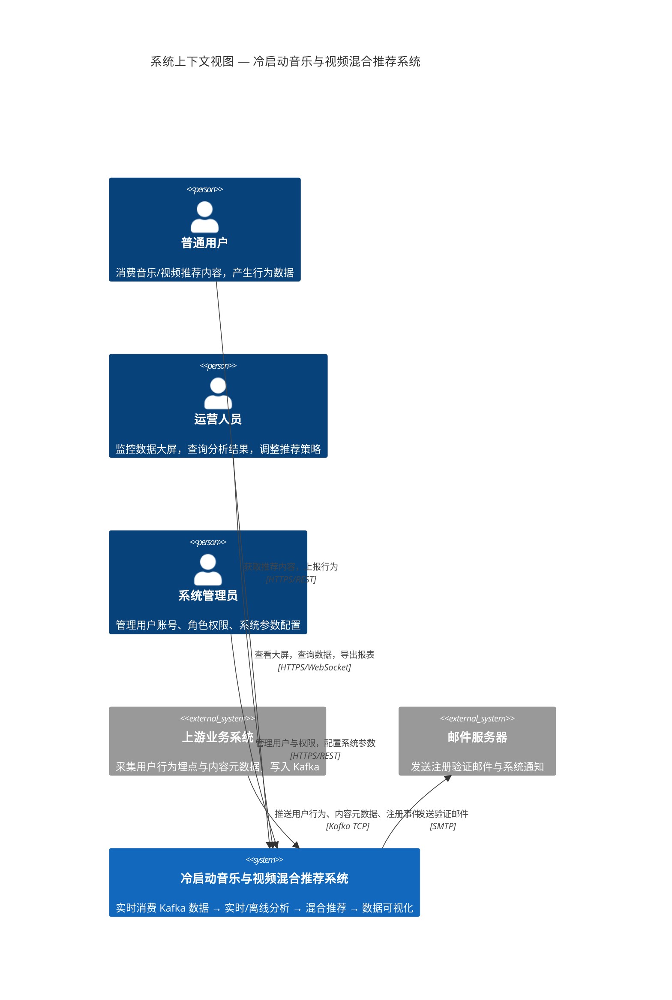
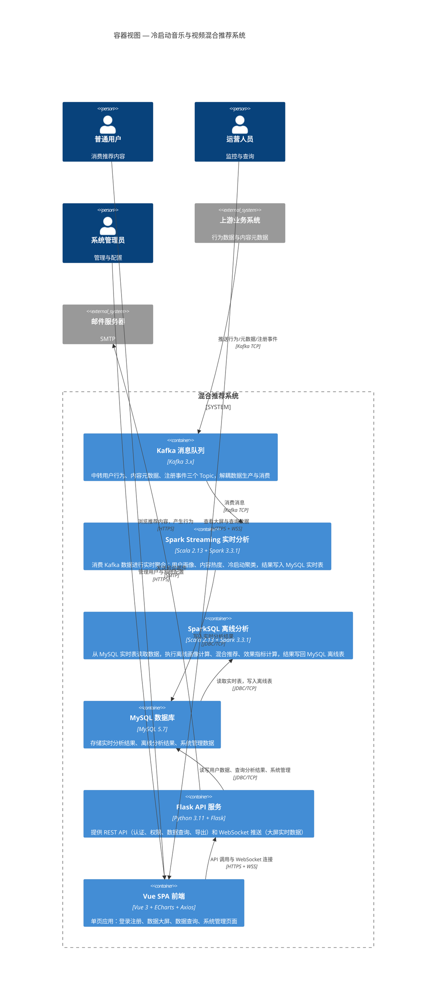
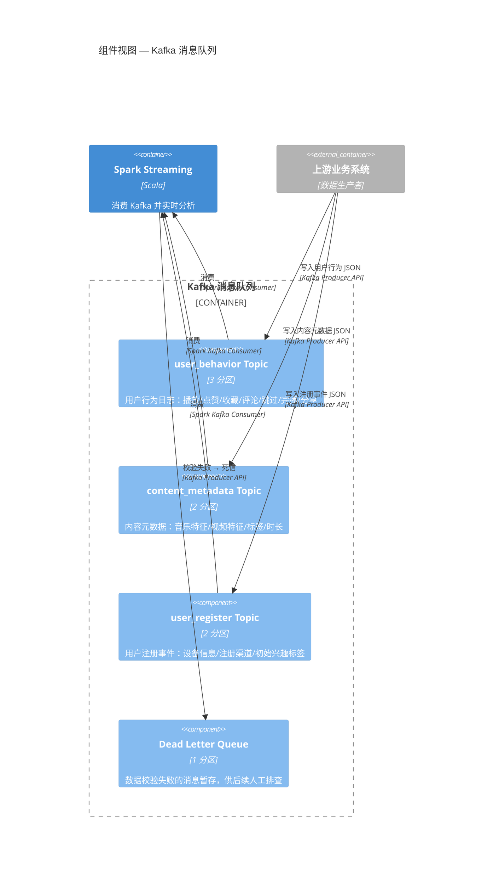
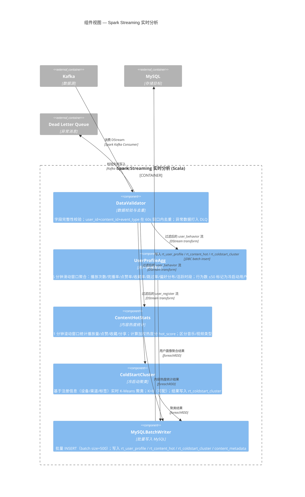
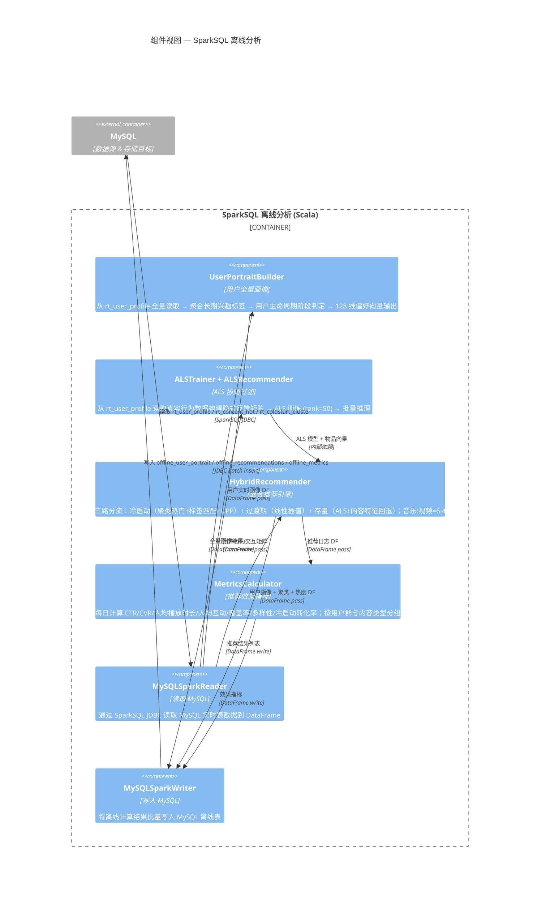
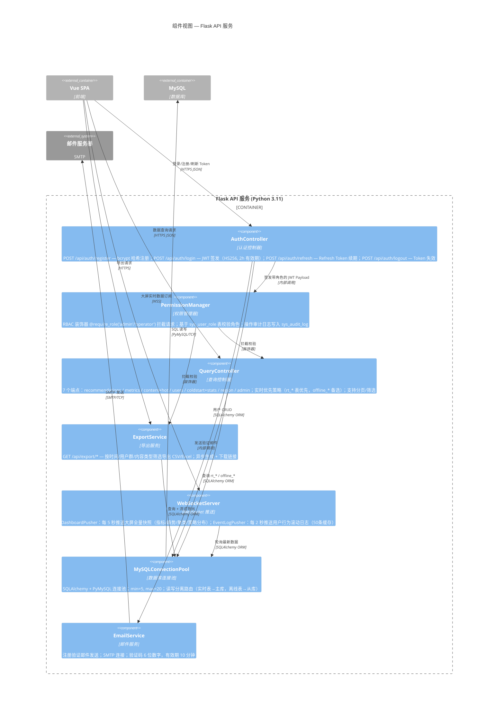
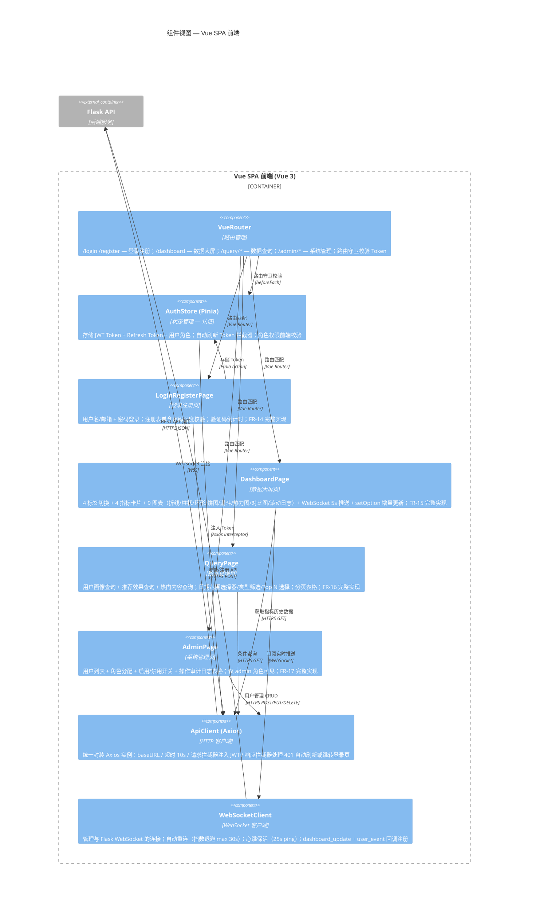

# C4 架构视图 — 冷启动音乐与视频混合推荐系统

> 使用 [Mermaid](https://mermaid.js.org/syntax/c4.html) C4 建模语言绘制  
> 覆盖四个抽象层级：System Context → Container → Component → Code  
> 版本：V1.2 / 日期：2026-06-13

---

## 1. C4 Level 1 — 系统上下文视图 (System Context)



### 元素说明

| 元素 | 类型 | 说明 |
|------|------|------|
| 普通用户 | Person | 平台终端用户，消费推荐内容（音乐+视频），产生播放、点赞、收藏等行为 |
| 运营人员 | Person | 查看数据大屏实时监控，条件查询 MySQL 分析结果，导出数据报表 |
| 系统管理员 | Person | 用户账号 CRUD、角色分配、系统参数配置、模型版本管理 |
| 上游业务系统 | External System | 负责采集用户行为埋点与内容元数据，以 JSON 格式写入 Kafka 三个 Topic |
| 邮件服务器 | External System | 发送账户注册验证邮件，系统通知邮件 |
| 混合推荐系统 | System | 本项目的核心系统，覆盖数据接入→实时分析→离线推荐→后端服务→前端展示全链路 |

---

## 2. C4 Level 2 — 容器视图 (Container View)



### 容器职责

| 容器 | 技术栈 | 核心职责 |
|------|--------|---------|
| Kafka | Kafka 3.x | 消息中间件，承载 3 个 Topic（user_behavior, content_metadata, user_register），解耦上游与 Spark 消费端 |
| Spark Streaming | Scala 2.13.10 + Spark 3.3.1 | 实时消费 Kafka，5 分钟窗口聚合用户画像，1 分钟窗口统计内容热度，实时 K-Means 冷启动聚类，内容元数据持久化 |
| SparkSQL 离线 | Scala 2.13.10 + Spark 3.3.1 | 全量画像更新，ALS 模型训练（隐式反馈），混合推荐（三路分流+DPP+内容特征回退），每日指标统计 |
| MySQL | MySQL 5.7 | 核心存储：实时表 3 张（rt_*）、离线表 3 张（offline_*）、系统表 4 张（sys_*）、内容元数据表（content_metadata），共 11 张表 |
| Flask API | Python 3.11 + Flask | 认证/授权/查询/导出 REST API，WebSocket 实时推送 |
| Vue SPA | Vue 3 + ECharts + Axios | 前端单页应用，ECharts 数据大屏（7 图表 + 热力图），条件查询表单，管理系统界面 |

---

## 3. C4 Level 3 — 组件视图 (Component View)

### 3.1 Kafka 消息队列 — 组件视图



### 3.2 Spark Streaming 实时分析 — 组件视图



### 3.3 SparkSQL 离线分析 — 组件视图



### 3.4 Flask API 服务 — 组件视图



### 3.5 Vue SPA 前端 — 组件视图



---

## 4. C4 Level 4 — 代码视图 (Code View)

> Mermaid 无原生 C4Code 图类型，使用 **Class Diagram** 按模块展示核心类/对象及其关系。

### 4.1 Spark Streaming 实时分析 — 代码级类图

```mermaid
classDiagram
    title 代码视图 — Spark Streaming 实时分析模块

    %% ========== 入口 ==========
    class RealTimeAnalysisApp {
        +main(args: Array[String]): Unit
        -buildSparkSession(): SparkSession
        -createKafkaStream(ss: SparkSession, topics: Seq[String]): DStream[String]
    }

    %% ========== 数据模型 ==========
    class UserBehaviorEvent {
        +eventId: String
        +userId: Long
        +contentId: Long
        +contentType: String
        +eventType: String
        +eventTime: Timestamp
        +duration: Double
        +deviceType: String
        +channel: String
        +sessionId: String
        -isValid(): Boolean
    }

    class ContentMetaEvent {
        +contentId: Long
        +contentType: String
        +title: String
        +artistOrAuthor: String
        +styleOrCategory: String
        +tags: Array[String]
        +duration: Double
        +language: String
        +bpm: Double
        +resolution: String
        +createTime: Timestamp
    }

    class UserRegisterEvent {
        +userId: Long
        +registerTime: Timestamp
        +deviceType: String
        +osVersion: String
        +registerChannel: String
        +interestTags: Array[String]
        +region: String
    }

    %% ========== 数据校验 ==========
    class DataValidator {
        -requiredFields: Map[String, Seq[String]]
        -seenCache: Cache[(Long,Long,String), Boolean]
        +validateBehavior(json: String): Either[String, UserBehaviorEvent]
        +validateMeta(json: String): Either[String, ContentMetaEvent]
        +validateRegister(json: String): Either[String, UserRegisterEvent]
        +deduplicate(event: UserBehaviorEvent): Boolean
        -checkFields(json: JsValue, fields: Seq[String]): Boolean
        -sendToDLQ(invalidJson: String, reason: String): Unit
    }

    %% ========== 用户画像聚合 ==========
    class UserProfileAgg {
        -windowDuration: Duration
        -slideDuration: Duration
        -coldStartThreshold: Int
        +aggregate(stream: DStream[UserBehaviorEvent]): DStream[UserProfile]
        -extractFeatures(events: Iterable[UserBehaviorEvent]): UserFeatures
        -isColdStart(featureCount: Int): Boolean
        -calcPlayCount(events: Iterable[UserBehaviorEvent]): Int
        -calcCompletionRate(events: Iterable[UserBehaviorEvent]): Double
        -calcLikeRate(events: Iterable[UserBehaviorEvent]): Double
        -calcFavoriteRate(events: Iterable[UserBehaviorEvent]): Double
        -calcSkipRate(events: Iterable[UserBehaviorEvent]): Double
        -calcPreferenceDistribution(events: Iterable[UserBehaviorEvent]): Map[String, Double]
        -calcActiveHours(events: Iterable[UserBehaviorEvent]): Map[Int, Int]
    }

    class UserProfile {
        +userId: Long
        +windowStart: Timestamp
        +windowEnd: Timestamp
        +playCount: Int
        +completionRate: Double
        +likeRate: Double
        +favoriteRate: Double
        +skipRate: Double
        +preferenceDistribution: String
        +activeHours: String
        +isColdStart: Boolean
        +behaviorCount: Int
    }

    %% ========== 内容热度 ==========
    class ContentHotStats {
        -windowDuration: Duration
        -weightPlay: Double
        -weightCompletion: Double
        -weightInteraction: Double
        +computeHotness(stream: DStream[UserBehaviorEvent]): DStream[ContentHot]
        -calcHotScore(playCount: Long, completionRate: Double, interactionRate: Double): Double
    }

    class ContentHot {
        +contentId: Long
        +contentType: String
        +playCount: Long
        +likeCount: Long
        +favoriteCount: Long
        +shareCount: Long
        +completionRate: Double
        +interactionRate: Double
        +hotScore: Double
        +windowStart: Timestamp
        +windowEnd: Timestamp
    }

    %% ========== 冷启动聚类 ==========
    class ColdStartCluster {
        -k: Int
        -maxIterations: Int
        -featureCols: Array[String]
        +cluster(stream: DStream[UserRegisterEvent]): DStream[ClusterResult]
        -encodeFeatures(event: UserRegisterEvent): Vector
        -trainOrUpdateModel(features: RDD[Vector]): KMeansModel
        -predictCluster(model: KMeansModel, features: Vector): Int
    }

    class ClusterResult {
        +userId: Long
        +clusterId: Int
        +clusterCenter: String
        +clusterSize: Int
        +computeTime: Timestamp
    }

    %% ========== MySQL 批量写入 ==========
    class MySQLBatchWriter {
        -batchSize: Int
        -jdbcUrl: String
        -tableNames: Map[String, String]
        +writeUserProfile(rdd: RDD[UserProfile]): Unit
        +writeContentHot(rdd: RDD[ContentHot]): Unit
        +writeClusterResult(rdd: RDD[ClusterResult]): Unit
        -batchInsert[T](rdd: RDD[T], tableName: String, f: T => PreparedStatement): Unit
    }

    %% ========== 关系 ==========
    RealTimeAnalysisApp --> DataValidator : "解析 JSON → 校验"
    RealTimeAnalysisApp --> UserProfileAgg : "校验后流 → 聚合"
    RealTimeAnalysisApp --> ContentHotStats : "校验后流 → 热度"
    RealTimeAnalysisApp --> ColdStartCluster : "校验后流 → 聚类"
    RealTimeAnalysisApp --> MySQLBatchWriter : "结果 → 写入"

    DataValidator ..> UserBehaviorEvent : "产出"
    DataValidator ..> ContentMetaEvent : "产出"
    DataValidator ..> UserRegisterEvent : "产出"
    UserProfileAgg ..> UserProfile : "产出"
    ContentHotStats ..> ContentHot : "产出"
    ColdStartCluster ..> ClusterResult : "产出"

    MySQLBatchWriter ..> UserProfile : "写入"
    MySQLBatchWriter ..> ContentHot : "写入"
    MySQLBatchWriter ..> ClusterResult : "写入"

    UserProfileAgg --> DataValidator : "消费 validatedBehaviorStream"
    ContentHotStats --> DataValidator : "消费 validatedBehaviorStream"
    ColdStartCluster --> DataValidator : "消费 validatedRegisterStream"
```

### 4.2 Flask API 服务 — 代码级类图

```mermaid
classDiagram
    title 代码视图 — Flask API 服务

    %% ========== 工厂 ==========
    class ApplicationFactory {
        +create_app(config_name: str): Flask
        -register_extensions(app: Flask): void
        -register_blueprints(app: Flask): void
        -register_error_handlers(app: Flask): void
    }

    %% ========== 认证 ==========
    class AuthBlueprint {
        <<blueprint>>
        +POST /api/auth/register
        +POST /api/auth/login
        +POST /api/auth/refresh
        +POST /api/auth/logout
        +GET /api/auth/verify-email
    }

    class AuthService {
        +register(username: str, email: str, password: str): User
        +login(account: str, password: str): TokenPair
        +refresh_token(refresh_token: str): TokenPair
        +logout(user_id: int): void
        +verify_email(token: str): bool
        -hash_password(password: str): str
        -verify_password(password: str, hashed: str): bool
        -generate_jwt(user: User): str
        -generate_refresh_token(user_id: int): str
    }

    class TokenPair {
        +access_token: str
        +refresh_token: str
        +token_type: str
        +expires_in: int
    }

    %% ========== 权限 ==========
    class PermissionManager {
        +require_role(*roles: str): Callable
        +require_permission(*permissions: str): Callable
        +get_user_roles(user_id: int): List[str]
        +has_role(user_id: int, role: str): bool
        +assign_role(admin_id: int, user_id: int, role: str): void
        +revoke_role(admin_id: int, user_id: int, role: str): void
        -audit_log(operator_id: int, action: str, target: str): void
    }

    %% ========== 查询 ==========
    class QueryBlueprint {
        <<blueprint>>
        +GET /api/recommendations
        +GET /api/metrics
        +GET /api/content/hot
        +GET /api/users/profile
        +GET /api/coldstart/analysis
    }

    class QueryService {
        +get_recommendations(user_id: int, page: int, size: int): PageResult
        +get_metrics(start: str, end: str, group_by: str): List[Metric]
        +get_hot_content(content_type: str, top_n: int): List[ContentHot]
        +get_user_profile(user_id: int): UserProfile
        +get_coldstart_analysis(): ColdStartAnalysis
        -apply_filters(query: Query, filters: Dict): Query
        -paginate(query: Query, page: int, size: int): PageResult
    }

    %% ========== 导出 ==========
    class ExportBlueprint {
        <<blueprint>>
        +GET /api/export/metrics
        +GET /api/export/recommendations
        +GET /api/export/users
    }

    class ExportService {
        +export_metrics(start: str, end: str, format: str): str
        +export_recommendations(user_id: int, format: str): str
        +export_users(filters: Dict, format: str): str
        -to_csv(data: DataFrame, filepath: str): str
        -to_excel(data: DataFrame, filepath: str): str
        -async_generate(task_id: str, func: Callable, *args): void
    }

    %% ========== WebSocket ==========
    class WebSocketBlueprint {
        <<blueprint>>
        +ws /ws/dashboard
        +ws /ws/events
    }

    class DashboardPusher {
        -connections: Set[WebSocket]
        -interval: int
        +register(ws: WebSocket): void
        +unregister(ws: WebSocket): void
        +start_push_loop(): void
        -collect_latest_metrics(): Dict
        -broadcast(payload: str): void
    }

    class EventLogPusher {
        -connections: Set[WebSocket]
        +register(ws: WebSocket): void
        +unregister(ws: WebSocket): void
        +push_event(event: UserBehaviorEvent): void
    }

    %% ========== 邮件 ==========
    class EmailService {
        -smtp_host: str
        -smtp_port: int
        -sender: str
        +send_verification(to: str, code: str): void
        +send_notification(to: str, subject: str, body: str): void
        -build_verification_email(code: str): MIMEText
        -connect(): SMTP
    }

    %% ========== 数据模型 ==========
    class User {
        +id: int
        +username: str
        +email: str
        +password_hash: str
        +is_active: bool
        +is_verified: bool
        +created_at: datetime
        +updated_at: datetime
    }

    class Role {
        +id: int
        +name: str
        +description: str
    }

    class AuditLog {
        +id: int
        +operator_id: int
        +action: str
        +target: str
        +detail: str
        +created_at: datetime
    }

    %% ========== 关系 ==========
    ApplicationFactory --> AuthBlueprint : "注册"
    ApplicationFactory --> QueryBlueprint : "注册"
    ApplicationFactory --> ExportBlueprint : "注册"
    ApplicationFactory --> WebSocketBlueprint : "注册"
    ApplicationFactory --> PermissionManager : "初始化"

    AuthBlueprint --> AuthService : "调用"
    AuthBlueprint --> EmailService : "发验证邮件"
    AuthService ..> TokenPair : "返回"
    AuthService --> User : "操作"
    AuthService --> PermissionManager : "记录审计日志"

    QueryBlueprint --> PermissionManager : "@require_role 拦截"
    QueryBlueprint --> QueryService : "调用"

    ExportBlueprint --> PermissionManager : "@require_role 拦截"
    ExportBlueprint --> ExportService : "调用"

    WebSocketBlueprint --> DashboardPusher : "路由"
    WebSocketBlueprint --> EventLogPusher : "路由"

    DashboardPusher --> QueryService : "查询最新指标"
    EventLogPusher --> QueryService : "查询最新事件"

    PermissionManager --> AuditLog : "写入"
    PermissionManager --> User : "查询角色"
    PermissionManager --> Role : "查询角色"

    QueryService --> User : "关联查询"
    ExportService --> QueryService : "复用查询逻辑"
```

---

## 附录：视图索引

| 视图 | 层级 | 关注点 | 目标读者 |
|------|------|--------|---------|
| 系统上下文视图 | Level 1 | 系统与外部的交互边界 | 全体干系人 |
| 容器视图 | Level 2 | 技术选型与容器间通信 | 架构师、技术负责人 |
| Kafka 组件视图 | Level 3 | 消息队列内部组件与数据流 | 数据工程师 |
| Spark Streaming 组件视图 | Level 3 | 实时分析组件职责与管道 | 数据工程师 |
| SparkSQL 组件视图 | Level 3 | 离线分析组件职责与管道 | 数据工程师 |
| Flask 组件视图 | Level 3 | 后端 API 组件职责与路由 | 后端开发 |
| Vue 组件视图 | Level 3 | 前端页面组件与通信 | 前端开发 |
| Spark Streaming 代码视图 | Level 4 | 实时分析类结构与关系 | 开发工程师 |
| Flask 代码视图 | Level 4 | 后端类结构与关系 | 开发工程师 |
